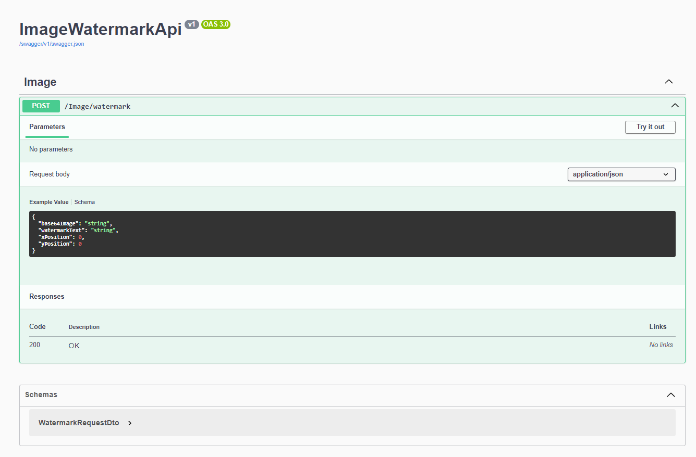
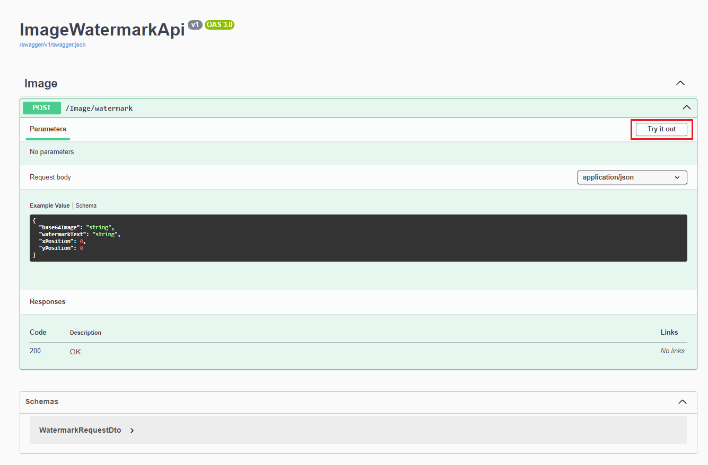
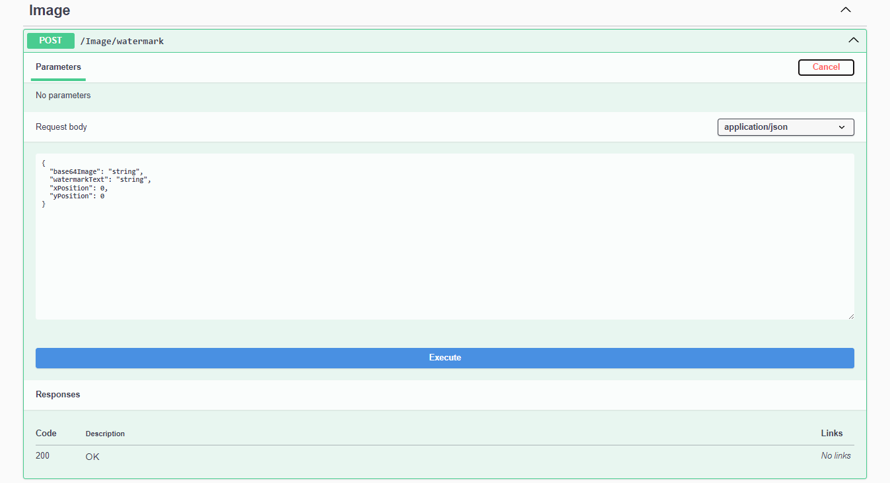
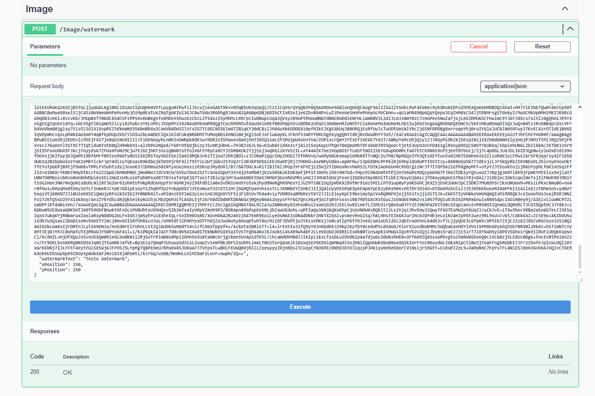
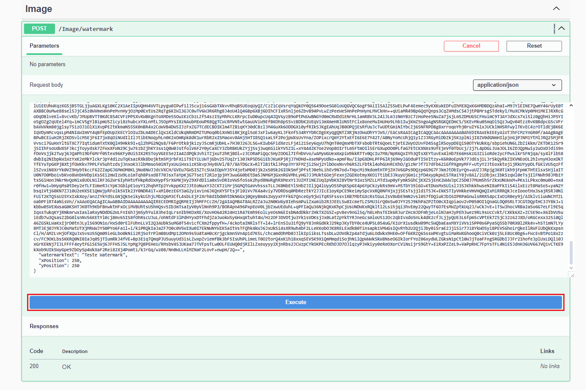
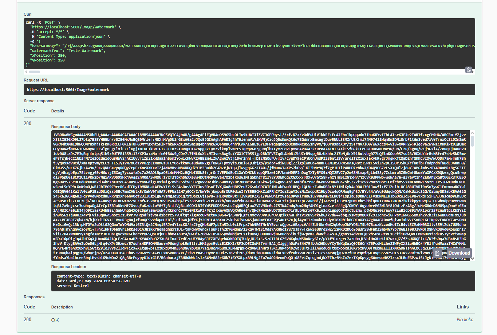
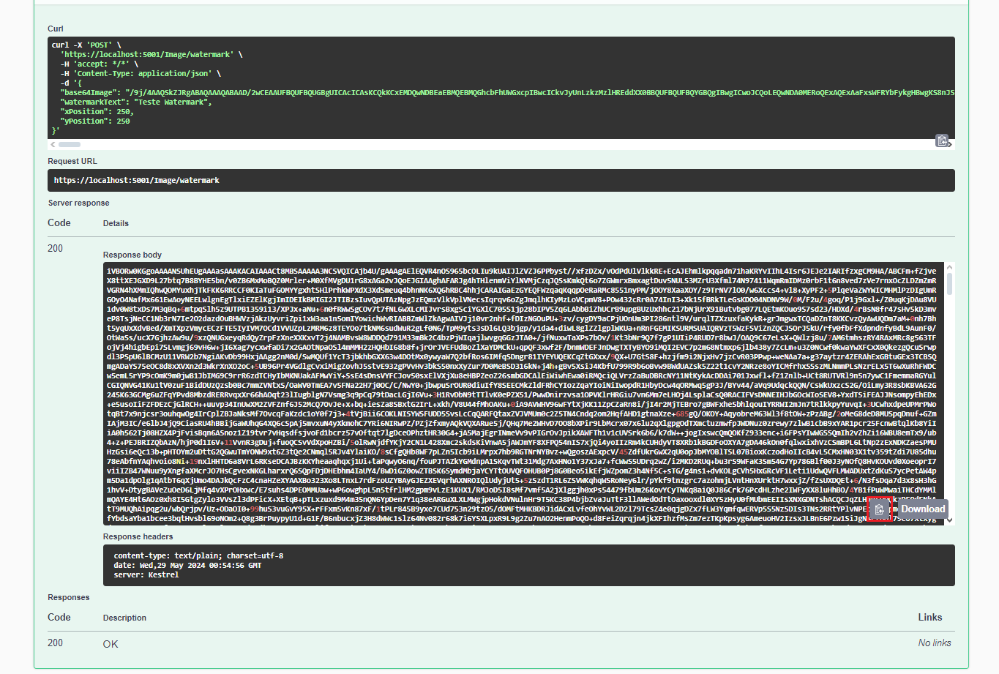

# Image WaterMark API - API de marca d'água de imagem

Esta é uma API desenvolvida para aplicar d'água em imagens

## Project Setup - Configuração do Projeto

### Pré-requisitos - Prerequisites

- .NET 5.0 ou superior
- Um editor de código de sua escolha (Visual Studio, Visual Studio Code, etc.)

 

## Configuração

1. Clone este repositório para sua máquila local:
     
   `git clone https://github.com/RamonPessoaDev/api_watermark.git`
     
   `cd api_watermark`
     
2. Restaure as dependências do projeto:
   `dotnet restore`
     
3. Execute a aplicação: `dotnet run`

### Verifique a porta de execução

- Geralmente a aplicação será iniciada e estará escutando na porta padrão 5000 (ou 5001 para HTTPS). `https://localhost:5001/swagger/index.html`

## Uso

- Para aplicar uma marca d'água em uma imagem, faça uma requisição POST para /api/images/watermark com um corpo JSON contendo a imagem em base64, o texto da marca d'água, e as posições X e Y onde a marca d'água deve ser aplicada

## Convertendo uma imagem PNG para Base64

- Exemplo de site para codificar a imagem desejada para base64: `https://base64.guru/converter/encode/image`

- Em "Output Format" selecione JSON

- Na Imagem obtida, copie o que esta depois de "data": entre "", copie tudo se atente para não esquecer de copiar alguma letra ⚠

### Exemplo de requisição:

`{
"base64Image": "string",
"watermarkText": "string",
"xPosition": 0,
"yPosition": 0
}`

- Cole o que foi copiado do que estava entre aspas no lugar de `"string"`, em `"base64Image": "O código que copiou aqui"`

- Em `"watermarkText":` no lugar de `"string"`, coloque o que deseja utilizar como marca d'água exemplo: `"watermarkText": "Teste Watermark"`

- Nas posições, `"xPosition":` Um número inteiro representando a posição X onde a marca d'água deve ser aplicada na imagem.
    
  `"yPosition":` Um número inteiro representando a posição Y onde a marca d'água deve ser aplicada na imagem.

## Resposta

A API retorna a imagem com a marca d'água aplicada, codificada em base64. Você pode decodificar esta resposta para visualizar a imagem resultante.

- Exemplo de site para decodificar a imagem resultante (PNG): `https://base64.guru/converter/decode/image/png`

## Imagens de guia ✅

### Imagem 1

### Imagem 2

### Imagem 3

### Imagem 4

### Imagem 5

### Imagem 6

### Imagem 7

